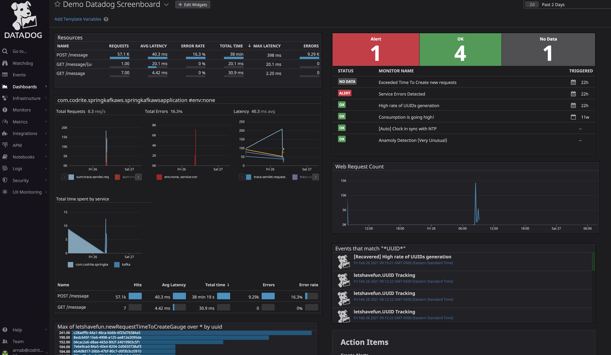

# Getting Started

### Reference Documentation
For further reference, please consider the following sections:

* [Official Apache Maven documentation](https://maven.apache.org/guides/index.html)
* [Spring Boot Maven Plugin Reference Guide](https://docs.spring.io/spring-boot/docs/2.4.0/maven-plugin/reference/html/)
* [Create an OCI image](https://docs.spring.io/spring-boot/docs/2.4.0/maven-plugin/reference/html/#build-image)
* [Spring Web](https://docs.spring.io/spring-boot/docs/2.4.0/reference/htmlsingle/#boot-features-developing-web-applications)
* [Spring for Apache Kafka](https://docs.spring.io/spring-boot/docs/2.4.0/reference/htmlsingle/#boot-features-kafka)

### Guides
The following guides illustrate how to use some features concretely:

* [Building a RESTful Web Service](https://spring.io/guides/gs/rest-service/)
* [Serving Web Content with Spring MVC](https://spring.io/guides/gs/serving-web-content/)
* [Building REST services with Spring](https://spring.io/guides/tutorials/bookmarks/)

###  About this application 
This is a simple springboot web application to demo datadog integration.

Application  Endpoint - http://localhost:8081/message

#### Get
  uuid sent to this endpoint is looked up in map and removed, the timestamp value is returned to the caller.

#### Post
  creates a uuid and timestamp followed by pushing it to kafka test topic
  consumer of the kafka topic adds the message in a map.

#### Pre-requisites
- You will need to run kafka locally but thats it, no additional step (default topic creation is enabled)
- You will need to install datadog agent (better to install it on your local computer)
- Apache benchmark for load testing / simulating traffic.

#### Datadog Screenboard
- A Sample dashboard can be found in `datadog/demo-dashboard.json` that can be imported into datadog, no need to create from scratch

